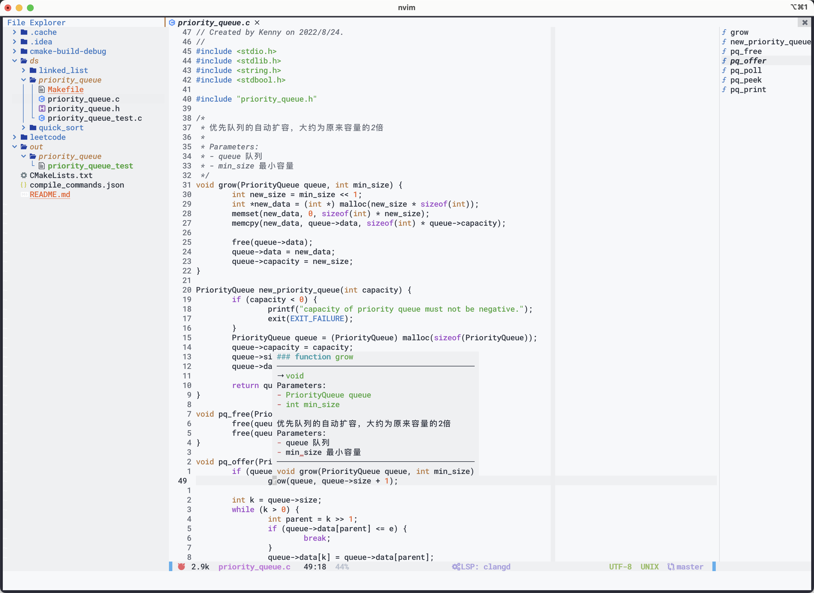

  

个人配置，用在别的机器可能会有些奇奇怪怪的问题，建议还是自己从头配置

    
    
    
    
    
    

---

<!-- vim-markdown-toc GFM -->

* [☀️  手动操作和外部工具依赖](#--手动操作和外部工具依赖)
* [🪐 所有的插件](#-所有的插件)
* [⚡️ 插件快捷键](#-插件快捷键)
    * [注释](#注释)
    * [文件目录浏览](#文件目录浏览)
    * [文件搜索](#文件搜索)
    * [代码大纲（outline）](#代码大纲outline)
    * [LSP 回调函数](#lsp-回调函数)
    * [nvim-cmp 自动补全](#nvim-cmp-自动补全)
    * [markdown](#markdown)
    * [多光标操作](#多光标操作)
* [🌟 注意点](#-注意点)
* [🌧 不足之处](#-不足之处)
* [🌈 Q&A](#-qa)
* [📃 协议](#-协议)

<!-- vim-markdown-toc -->

# ☀️  手动操作和外部工具依赖

> - [x] 表示必须
>
> - [ ] 表示可选

- [x] 安装 nerd-fonts (部分插件使用了文字图标，基于该字体)

- [x] 安装 tree-sitter，luajit，node(≥14)，npm

- [x] zip 解压软件
    - Unix 系统: unzip, tar, gzip
    - Windows 系统: 7zip, peazip, archiver, winzip, WinRAR

- [x] `MarkdownPreview` 命令如果不能执行，可能是 markdown-preview 插件没有安装好了，安装需要用到 npm 或者 yank 命令

- [x] 首次进入会自动安装 Packer 插件，安装完成后重启 neovim，执行 :PackerSync 进行插件下载

- [x] 所有插件安装完成后，执行 :MasonInstall 安装需要的 language server 

- [ ] 你可能需要安装 `ripgrep` 程序以用来搜索项目中的关键词

**如果有什么问题，可以尝试运行 :checkhealth 命令查看并解决**

# 🪐 所有的插件
- [wbthomason/packer.nvim](https://www.github.com/wbthomason/packer.nvim) (插件管理器)
- [vim-lualine/lualine.nvim](https://www.github.com/vim-lualine/lualine.nvim) (状态栏)
- [akinsho/bufferline.nvi](https://www.github.com/akinsho/bufferline.nvim) (顶部文件 tab 列表管理)
- [Raimondi/delimitMate](https://www.github.com/Raimondi/delimitMate) (自动括号补全)
- [tpope/vim-commentary](https://www.github.com/tpope/vim-commentary) (代码注释)
- [kyazdani42/nvim-tree.lua](https://www.github.com/kyazdani42/nvim-tree.lua) (文件目录树管理)
- [stevearc/aerial.nvim](https://www.github.com/stevearc/aerial.nvim) (函数、变量等等的列表)
- [nvim-telescope/telescope.nvim](https://www.github.com/nvim-telescope/telescope.nvim) (文件模糊搜索，搜索范围在 nvim 启动目录及其子目录下)
- [goolord/alpha-nvim](https://www.github.com/goolord/alpha-nvim) (开始界面)
- [rmehri01/onenord.nvim](https://www.github.com/rmehri01/onenord.nvim) (主题)
- [iamcco/markdown-preview.nvim](https://www.github.com/iamcco/markdown-preview.nvim) (Markdown 文件预览，需要借助外部浏览器)
- [mzlogin/vim-markdown-toc](https://www.github.com/mzlogin/vim-markdown-toc) (Markdown 目录自动生成)
- [mg979/vim-visual-multi](https://github.com/mg979/vim-visual-multi) (多光标操作)
- 代码提示与补全(基于内置 lsp 和 nvim-cmp)
    - [williamboman/mason.nvim](https://www.github.com/williamboman/mason.nvim) (lsp 服务管理)
    - [williamboman/mason-lspconfig.nvim](https://www.github.com/williamboman/mason-lspconfig.nvim) (-)
    - [neovim/nvim-lspconfig](https://www.github.com/neovim/nvim-lspconfig) (-)
    - [hrsh7th/cmp-nvim-lsp](https://www.github.com/hrsh7th/cmp-nvim-lsp) (-)
    - [hrsh7th/cmp-buffer](https://www.github.com/hrsh7th/cmp-buffer) (-)
    - [hrsh7th/cmp-path](https://www.github.com/hrsh7th/cmp-path) (路径提示)
    - [hrsh7th/cmp-cmdline](https://www.github.com/hrsh7th/cmp-cmdline) (命令行提示)
    - [hrsh7th/nvim-cmp](https://www.github.com/hrsh7th/nvim-cmp) (代码提示与补全、跳转等)
    - [hrsh7th/cmp-vsnip](https://www.github.com/hrsh7th/cmp-vsnip ) (-)
    - [hrsh7th/vim-vsnip](https://www.github.com/hrsh7th/vim-vsnip) (-)
    - [rafamadriz/friendly-snippets](https://www.github.com/rafamadriz/friendly-snippets) (-)
    - [onsails/lspkind-nvim](https://www.github.com/onsails/lspkind-nvim) (-)

# ⚡️ 插件快捷键
> 空格用 ⌴ 表示
>
> N 表示在 Normal 下的快捷键，V 表示在 Visual 模式，I 表示 Insert 模式
>
> CR 表示回车
>
> 比如 N\<Ctrl-/\> 表示在 Normal 模式下按住 ctrl 和 / 键
> 

## 注释

注释：N\<gc\>, V\<gc\>, N\<Ctrl-/\>, V\<Ctrl-/\>

解除注释：N\<gcc\>，V\<gcc\>，N\<Ctrl-/\>, V\<Ctrl-/\>

Visual 模式下主要用来选中多行代码然后全部注释掉

## 文件目录浏览

打开目录树：N\<⌴-1\>

定位到当前编辑的文件：N\<⌴-2\>, N\<⌴-m-f\>

刷新目录树：N\<⌴-m-r\>

操作文件(前提是先把光标定位到对应的文件（夹）)
 - 打开文件（文件夹）: N\<CR\>, N\<o\>
 - 竖屏打开文件：N\<v\>
 - 横屏打开文件：N\<h\>
 - 创建文件：N\<a\>
 - 删除文件：N\<d\>
 - 重命名文件：N\<r\>
 - 剪切文件：N\<x\>
 - 复制文件：N\<c\>
 - 粘贴文件：N\<p\>
 - 复制文件名：N\<y\>
 - 复制文件路径：N\<Y\>
 - 复制文件绝对路径：N\<gy\>
 - 使用系统程序打开文件（比如记事本）：N\<s\>
 
## 文件搜索
 
从当前目录之下的文件中搜索关键词：N\<⌴-f-m\>

从项目根目录开始搜索文件：N\<⌴-f-f\>

从项目根目录开始搜索文件，包括隐藏文件：N\<⌴-f-a\>

查看当前 git 仓库的历史提交：N\<⌴-c-m\>

查看当前 git 仓库的 status 情况：N\<⌴-g-t\>

从整个项目中查找某个关键词（需要 rg 命令支持）：N\<⌴-f-w\>

下一项：I\<Ctrl-n\>

上一项：I\<Ctrl-p\>
 
## 代码大纲（outline）

打开大纲：N\<⌴-a\>

跳到前一项：N\<{\>

跳到后一项：N\<}\>

跳到当前项的父项的上一项：N\<[[\>

跳到当前项的父项的下一项：N\<]]\>

## LSP 回调函数

重命名变量或者方法：N\<⌴-r-n\>

跳转到变量或者方法的声明处：N\<g-d\>, N\<Ctrl-b\>

显示变量或者方法的注释：N\<g-h\>

显示方法的实现：N\<g-i\>

显示变量或者方法的引用：N\<g-r\>

格式化代码：N\<⌴-=\>

...待补充

## nvim-cmp 自动补全

选中提示：I\<CR\>, I\<Tab\>

下一项：I\<Ctrl-n\>

上一项：I\<Ctrl-p\>

## markdown

在当前位置生成目录：N\<⌴-t-o-c\>

启动 Markdown 预览（需要在 md 文件下才能用）: N\<⌴-m-p-v\>

## 多光标操作

具体使用建议看视频，[B站教程](https://www.bilibili.com/video/BV1Gy4y1q7Co/?vd_source=f587e25bd8b252e7c424ed1569b8fcd1)

竖直向下选择：N\<Ctrl-j\>

竖直向上选择：N\<Ctrl-k\>

# 🌟 注意点

# 🌧 不足之处

- 格式化需要借助外部程序进行格式化

# 🌈 Q&A

1. tree-sitter 高亮报错

使用 `:TSUpdate <lang>` 命令更新对应变成语言的 ts，比如 `TSUpdate lua`

# 📃 协议

[**MIT**](LICENSE)
